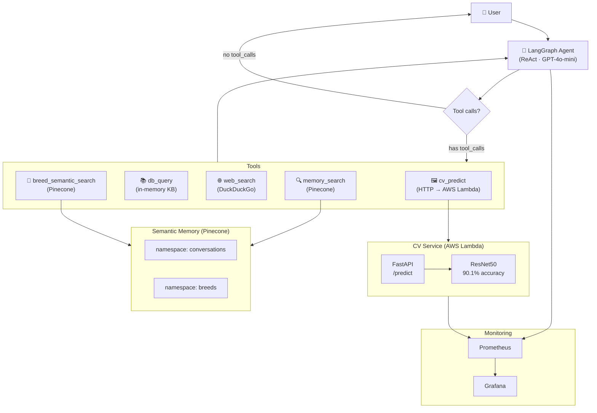

# Agentic Vision Cloud Orchestrator

> LangGraph ReAct agent · ResNet50 deployed on AWS Lambda · Pinecone semantic memory · Prometheus/Grafana monitoring

[](https://www.python.org/)
[](https://pytorch.org/)
[](https://github.com/langchain-ai/langgraph)
[](https://fastapi.tiangolo.com/)
[](https://aws.amazon.com/lambda/)
[](https://www.docker.com/)
[](https://huggingface.co/flaviodell)
[](LICENSE)

---

## Overview

This project implements a **production-grade agentic AI system** that combines computer vision, large language models, and cloud infrastructure into a single cohesive pipeline.

The agent receives natural language input from the user — including pet image URLs — and autonomously decides which tools to call, in which order, to produce an expert veterinary response. It can identify a dog or cat breed from an image, retrieve detailed breed information from a structured knowledge base, search the web for up-to-date veterinary content, and recall information from past conversations.

This repository is the second half of a two-part portfolio arc. It consumes the ResNet50 model trained and evaluated in [**llm-cv-finetuning-pipeline**](https://github.com/flaviodell/llm-cv-finetuning-pipeline), deploying it as a live cloud endpoint that the agent calls as a tool. The two repositories together tell a single end-to-end story: **train → evaluate → deploy → integrate into an agentic system**.

### What the agent can do

| Capability | How it works |
|---|---|
| Identify pet breed from image | Calls ResNet50 deployed on AWS Lambda |
| Retrieve structured breed info | Queries an in-memory knowledge base of 37 Oxford Pets breeds |
| Answer veterinary questions | Calls web search (DuckDuckGo, no API key needed) |
| Recall past conversations | Semantic retrieval from Pinecone vector database |
| Semantic breed recommendation | Embedding-based search over breed knowledge base |

---

## Architecture



The graph follows the **ReAct pattern** (Reason → Act → Observe): the agent node reasons using the LLM, the tools node executes the chosen tool, a post-tool `extract_breed` node persists structured data into the state, and control returns to the agent for the next reasoning step.

---

## Results at a Glance

### CV model — ResNet50 (trained in llm-cv-finetuning-pipeline)

| Metric | Value |
|---|---|
| Test accuracy | **90.1%** |
| Test F1 macro | **89.9%** |
| Architecture | ResNet50 (transfer learning — frozen backbone) |
| Classes | 37 Oxford Pets breeds |
| Deployment | AWS Lambda · API Gateway (eu-south-1) |
| Cold start latency | ~3–5 s (warm: < 1 s) |

### LLM — GPT-4o-mini (agent backbone)

| Metric | Value |
|---|---|
| Model | `gpt-4o-mini` (temperature=0) |
| Max reasoning turns | 10 (safety guard) |
| Tool call routing | LangGraph conditional edges |

### Memory — Pinecone

| Namespace | Content | Vectors |
|---|---|---|
| `conversations` | Past conversation turns | Dynamic |
| `breeds` | 37 Oxford Pets breed profiles | 37 |

---

## Tech Stack

| Component | Technology |
|---|---|
| Agent framework | LangGraph · LangChain |
| LLM | OpenAI GPT-4o-mini |
| CV inference | PyTorch · torchvision · ResNet50 |
| CV service | FastAPI · Mangum · AWS Lambda · ECR |
| Semantic memory | Pinecone · OpenAI `text-embedding-3-small` |
| Web search | duckduckgo-search (no API key) |
| Monitoring | Prometheus · Grafana (Docker Compose) |
| Containerisation | Docker · docker-compose |
| Model hosting | HuggingFace Hub (`flaviodell/oxford-pets-resnet50`) |
| Environment | Python 3.11 · venv |
| Testing | pytest · unittest.mock |

---

## Project Structure

```
agentic-vision-cloud-orchestrator/
│
├── agent/                          # LangGraph agent — core logic
│   ├── graph.py                    # StateGraph definition (ReAct topology)
│   ├── nodes.py                    # agent_node, should_continue, extract_breed
│   ├── runner.py                   # run_agent() and AgentSession (multi-turn)
│   ├── state.py                    # AgentState TypedDict
│   │
│   ├── tools/
│   │   ├── cv_tool.py              # cv_predict → HTTP call to AWS Lambda
│   │   ├── db_tool.py              # db_query → 37-breed in-memory knowledge base
│   │   ├── search_tool.py          # web_search → DuckDuckGo
│   │   └── memory_tool.py          # memory_search + breed_semantic_search → Pinecone
│   │
│   ├── memory/
│   │   ├── embedder.py             # OpenAI embed_text / embed_batch
│   │   ├── store.py                # Pinecone upsert / query / stats
│   │   └── manager.py              # save_conversation_turn, retrieve_relevant_context
│   │
│   └── monitoring/
│       └── metrics.py              # Prometheus Histogram / Counter for agent
│
├── cv_service/                     # FastAPI inference service (deployed on Lambda)
│   ├── Dockerfile                  # Lambda container image
│   ├── requirements.txt
│   └── app/
│       ├── main.py                 # /predict (URL) · /predict-file · /health
│       ├── model.py                # ResNet50 load + inference (PyTorch)
│       ├── schemas.py              # Pydantic response models
│       └── metrics.py              # Prometheus metrics for cv_service
│
├── infra/
│   └── aws/
│       ├── deploy.sh               # ECR push + Lambda update script
│       └── README.md               # AWS infrastructure documentation
│
├── monitoring/
│   ├── prometheus.yml              # Scrape config
│   └── grafana/
│       └── provisioning/
│           ├── datasources/        # Prometheus datasource
│           └── dashboards/         # cv_agent_dashboard.json
│
├── notebooks/
│   └── demo.ipynb                  # Interactive demo — agent conversation examples
│
├── tests/
│   ├── test_e2e.py                 # End-to-end: CV→DB, CV→web, multi-turn, MAX_TURNS
│   ├── test_graph.py               # LangGraph graph unit tests
│   ├── test_memory.py              # Pinecone memory integration tests
│   ├── test_monitoring.py          # Prometheus metrics tests
│   └── test_tools.py               # Individual tool unit tests
│
├── scripts/
│   └── setup_pinecone.py           # One-time: create index + populate breed knowledge
│
├── docker-compose.yml              # Prometheus + Grafana stack
├── Dockerfile                      # Main agent container
├── requirements.txt
└── .env.example                    # Environment variable template
```

---

## Quickstart

### 1. Clone and set up the virtual environment

```cmd
git clone https://github.com/flaviodell/agentic-vision-cloud-orchestrator.git
cd agentic-vision-cloud-orchestrator
python -m venv venv
venv\Scripts\activate
pip install -r requirements.txt
```

### 2. Configure environment variables

Copy `.env.example` to `.env` and fill in your keys:

```cmd
copy .env.example .env
```

Required keys:

```
OPENAI_API_KEY=...          # for the LLM (GPT-4o-mini) and embeddings
HF_TOKEN=...                # to download the ResNet50 checkpoint from HuggingFace
PINECONE_API_KEY=...        # for semantic memory (optional — agent works without it)
PINECONE_INDEX=agentic-vet-memory

# CV Service — use the live Lambda endpoint (recommended):
CV_SERVICE_URL=https://8r6akcsyx5.execute-api.eu-south-1.amazonaws.com/prod
# Or run locally with Docker:
# CV_SERVICE_URL=http://localhost:8000
```

### 3. (Optional) Populate Pinecone breed knowledge

Run once to embed all 37 breeds into the vector database:

```cmd
set PYTHONPATH=%CD%
python scripts/setup_pinecone.py
```

### 4. Run the agent

```cmd
set PYTHONPATH=%CD%
python -c "from agent.runner import AgentSession; s = AgentSession(); s.chat('What breed is in this image? https://images.dog.ceo/breeds/beagle/n02088364_10108.jpg')"
```

---

## Using the Agent

### Single-turn call

```python
from agent.runner import run_agent

result = run_agent("What breed is in https://images.dog.ceo/breeds/beagle/n02088364_10108.jpg?")
print(result["messages"][-1].content)
```

### Multi-turn session (recommended)

```python
from agent.runner import AgentSession

session = AgentSession()

session.chat("What breed is in this image? https://images.dog.ceo/breeds/beagle/n02088364_10108.jpg")
# → Agent calls cv_predict, db_query, returns breed info

session.chat("What are the most common health issues for this breed?")
# → Agent remembers the breed from the previous turn

session.chat("Is this breed good for families with children?")
# → Agent answers based on breed context + optional web search
```

### Example interaction

```
[User]: What breed is in this image?
        https://images.dog.ceo/breeds/beagle/n02088364_10108.jpg

[Agent]: I identified a Beagle with 91% confidence.

         Beagles are compact scent hounds originating from the UK. They are
         friendly, curious, and merry — excellent family dogs. Common health
         concerns include epilepsy, hip dysplasia, hypothyroidism, and ear
         infections. Typical lifespan: 10–15 years. Size: small-medium.

[User]: What should I feed a Beagle?

[Agent]: [calls web_search: "Beagle diet and nutrition"]
         Beagles tend to overeat and are prone to obesity, so portion control
         is essential. Vets typically recommend...
```

---

## Running Tests

```cmd
set PYTHONPATH=%CD%
pytest tests/ -v
```

The test suite covers 10 scenarios without requiring any external API keys (all LLM and HTTP calls are mocked):

- Full CV → DB pipeline
- CV → web search pipeline
- CV service error — graceful fallback
- Multi-turn session — breed context persists across turns
- System prompt deduplication across turns
- Agent output validation (non-empty reply, required state keys)
- `turn_count` increment check
- MAX_TURNS guard (agent stops at 10 iterations)
- Memory save called twice per `chat()` (user + assistant turn)
- DB tool — all 37 breeds resolve correctly

---

## Monitoring

### Start the monitoring stack

```cmd
docker-compose up -d
```

This starts:
- **Prometheus** at `http://localhost:9090` — scrapes agent and cv_service metrics
- **Grafana** at `http://localhost:3000` (login: `admin` / `admin`) — pre-provisioned dashboard

### Available metrics

| Metric | Type | Description |
|---|---|---|
| `agent_turn_latency_seconds` | Histogram | Latency per `run_agent()` call |
| `agent_turns_per_session` | Histogram | LangGraph turns used per session |
| `agent_tool_calls_total` | Counter | Tool invocations by tool name |
| `agent_sessions_total` | Counter | Total sessions started |
| `cv_inference_latency_seconds` | Histogram | CV service inference time |
| `cv_predictions_total` | Counter | Predictions by breed and status |
| `cv_confidence_score` | Histogram | Model confidence distribution |
| `cv_model_load_time_seconds` | Gauge | Model load time at startup |

---

## Cloud Deployment — AWS Lambda

The CV inference service is deployed as a Docker container on AWS Lambda, fronted by API Gateway.

**Live endpoint**: `https://8r6akcsyx5.execute-api.eu-south-1.amazonaws.com/prod`

```cmd
:: Health check
curl https://8r6akcsyx5.execute-api.eu-south-1.amazonaws.com/prod/health

:: Predict breed from image URL
curl -X POST https://8r6akcsyx5.execute-api.eu-south-1.amazonaws.com/prod/predict ^
  -H "Content-Type: application/json" ^
  -d "{\"image_url\": \"https://images.dog.ceo/breeds/beagle/n02088364_10108.jpg\"}"
```

**Infrastructure details:**

| Parameter | Value |
|---|---|
| Function name | `agentic-vision-orchestrator` |
| Region | `eu-south-1` |
| Runtime | Container image (Python 3.11) |
| Memory | 1024 MB |
| Timeout | 60 s |
| Model source | HuggingFace Hub (downloaded at cold start) |

To deploy a new version, see [`infra/aws/README.md`](infra/aws/README.md).

---

## Key Techniques

**LangGraph ReAct pattern** — the agent alternates between reasoning (LLM call) and acting (tool execution). The graph encodes this as a conditional edge: if the LLM response contains `tool_calls`, route to the `tools` node; otherwise, terminate. A post-tool `extract_breed` node persists structured output into the typed state between turns.

**Transfer learning + PyTorch** — the ResNet50 backbone (pretrained on ImageNet) is frozen; only the classifier head is trained. This achieves 90.1% accuracy on 37 breeds with fewer than 3,000 training images and a single T4 GPU. The full training loop — including custom DataLoaders, torchvision transforms, torchmetrics evaluation, and W&B tracking — is implemented in [llm-cv-finetuning-pipeline](https://github.com/flaviodell/llm-cv-finetuning-pipeline).

**Containerised ML inference** — the PyTorch model is packaged in a Docker image alongside a FastAPI application and deployed to AWS Lambda via Amazon ECR. The Mangum adapter bridges ASGI (FastAPI) and the Lambda event format. The ResNet50 checkpoint is downloaded from HuggingFace Hub at cold start and cached in `/tmp`.

**Semantic memory with Pinecone** — every conversation turn is embedded with `text-embedding-3-small` (1536 dimensions) and stored in Pinecone. On subsequent turns, the agent can retrieve semantically similar past exchanges. A separate namespace stores embeddings of all 37 breed profiles, enabling fuzzy queries like _"recommend a calm cat for a small apartment"_.

**Graceful degradation** — if Pinecone is unavailable (no API key configured), all memory operations silently skip and the agent continues to function using only its in-context tools. The same pattern applies to the CV service: a connection error returns a structured `{"error": ...}` JSON that the LLM can reason about rather than raising an exception.

**Prometheus + Grafana observability** — both the agent runner and the CV service expose Prometheus metrics. Histograms track latency distributions; counters track tool call frequency and session counts. A pre-provisioned Grafana dashboard visualises all metrics with zero manual configuration.

---

## Connection to llm-cv-finetuning-pipeline

This repository is the deployment and orchestration layer of a two-part portfolio arc:

| Repository | Role |
|---|---|
| [llm-cv-finetuning-pipeline](https://github.com/flaviodell/llm-cv-finetuning-pipeline) | Trains ResNet50 (transfer learning) + fine-tunes Mistral 7B (LoRA/QLoRA) |
| [agentic-vision-cloud-orchestrator](https://github.com/flaviodell/agentic-vision-cloud-orchestrator) | Deploys ResNet50 on AWS Lambda · integrates it as a tool in a LangGraph agent |

The ResNet50 checkpoint produced in [llm-cv-finetuning-pipeline](https://github.com/flaviodell/llm-cv-finetuning-pipeline) is pulled from HuggingFace Hub (`flaviodell/oxford-pets-resnet50`) and served live by the `cv_service`. This closes the full ML lifecycle loop:

```
Train (llm-cv-finetuning-pipeline) → Evaluate (llm-cv-finetuning-pipeline) → Deploy (agentic-vision-cloud-orchestrator) → Integrate in agentic system (agentic-vision-cloud-orchestrator)
```

---

## License

MIT — see [LICENSE](LICENSE) for details.
